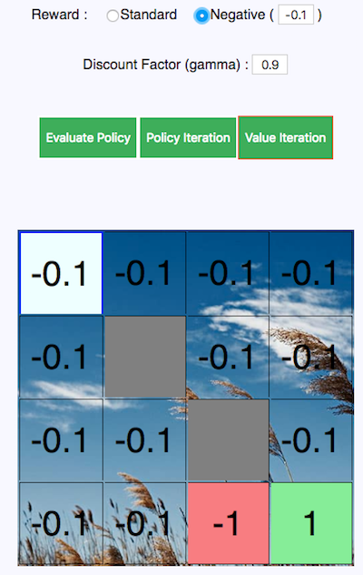

### What's this ?

This is my implementation of the popular Grid World in Javascript using React JS.
(I'll use it as a playground to learn about the ABCs of Reinforcement Learning.)

### Implemented Algorithms:

#### - Policy Evaluation

#### - Policy Iteration

#### - Value Iteration

### Features:

- It's possible to customize the grid's dimensions and the positions of :
    - Goal State ( Terminal State which should be reached )
    - Hole State ( Terminal State which should be avoided)
    - Wall States ( Obstacle States )
    - Start State

- It's possible to customize the Step Cost ( Rewards for normal states )

- It's possible to inspect the Logs of the operations being done when executing the Algorithms

### Screenshots:

#### Customize the Grid:

#### Set Step Cost:

#### Execute Algorithm:

#### Algorithm Converged:

#### Inspect Logs:

