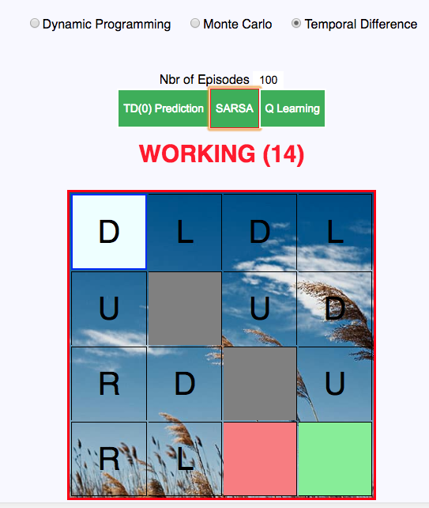

## What's this ?

- This project is my implementation of the popular **Grid World** in *Javascript ES6* using React JS.

- **Grid World** is a popular playground to learn the ABCs of Reinforcement Learning. The goal of the game is to make the agent go from Start State to Goal State while avoiding the walls and the Hole.

- Instead of reimplementing the algorithms using the same language (Python), I opted for changing the language and making things little more visual in order to deepen my understanding of the algorithms. ( Note: some algorithms might be slow, it's totally normal, it's all run on the browser and it's Javascript + I added visual effects when the agent moves ).

## How to run ?
- This is a React JS Project. A simple "npm start" will normally suffice.

## Implemented Algorithms

### - Dynamic Programming techniques :
    They are based on the Bellman equation and provide optimal solutions.
    (Iterative Policy Evaluation, Policy Iteration and Value Iteration).

### - Monte Carlo techniques :
    They use experience and depend on playing Full episodes before calculating the Values. (MC Prediction and MC Control)
    

### - Temporal Difference techniques :
    They are fully 'Online' and update Values while playing the episodes.
    (TD(0), SARSA, Q-Learning)

## Features:

- It's possible to customize the grid's dimensions and the positions of :
    - **Goal State** ( Terminal State which should be reached )
    - **Hole State** ( Terminal State which should be avoided)
    - **Wall States** ( Obstacle States )
    - **Start State**

- It's also possible to customize different properties such as:
    - **Step Cost** ( Rewards that the Agent gets when transitioning from one state to another )
    - **Number of Episodes** that the agent plays ( for Monte Carlo and Temporal Difference techniques)
    - **GAMMA** (Discount Factor)

- It's possible to inspect the Logs of the operations being done when executing the Algorithms

## Screenshots:

### Customize the Grid:

### Execute Algorithm:

### Algorithm Converged:

### Inspect Logs:

